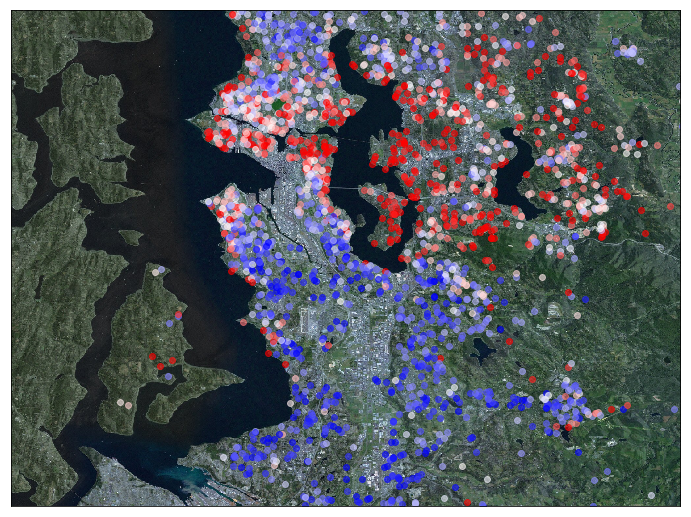
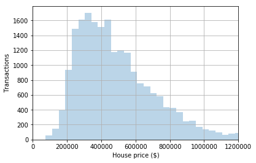
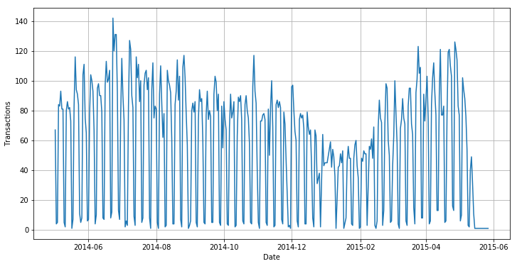
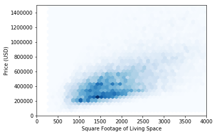
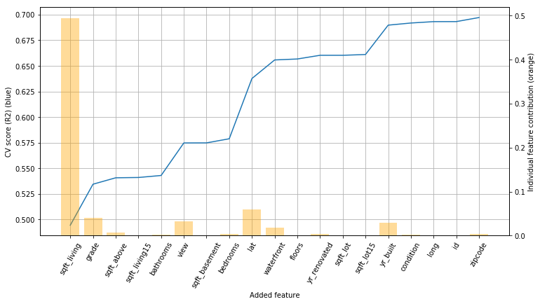

# House Sales in King County
Analysis of sales prices for house transactions in the Seattle area. The data are visualized in plots and on a map, and I'm building a regression model predicting sales price based on the other features.

[View the jupyter notebook here](https://nbviewer.jupyter.org/github/christopherbronner/house-prices/blob/master/house_prices_deliver.ipynb)

In this project, a data set of house transactions in King County (Seattle area) is analyzed. Besides price, there are 20 other features in the data, the most important of which are related to the square footage of the house, number of bedrooms and bathrooms, and a grade on a scale from 1 to 12.

In the first part, I am visualizing the data in various ways. For example, I'm analyzing the distribution of sales prices and their development over the course of a year and a week. In addition, I'm visualizing the relationship and correlation between the individual features.

In the second part, I'm building a regression model capable of predicting the sales price of a house based on the other features of the data set. I use different regression algorithms and implement feature selection in two ways (by correlation with price, and via recursive feature elimination). Then, I add quadratic and cubic features through PolynomialFeatures(). Adding cubic terms slows the training down significantly and in order to reduce the computational cost I combine creating polynomial features with principal component analysis (PCA).

Overall, a linear regression model works the best, in conjunction with quadratic features. The accuracy of this model as measured with R2 is 0.82.

Finally, I visualize the difference in sales prices on a map. Blue indicates cheaper houses which are mostly found south of the city of Seattle and near the airport. More expensive homes are marked in red and are found in downtown Seattle and near the water.

